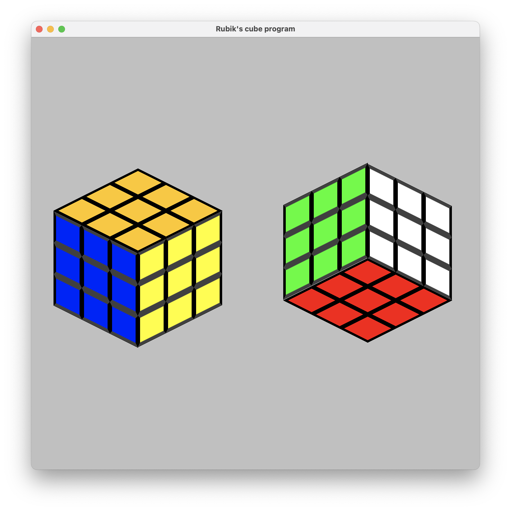
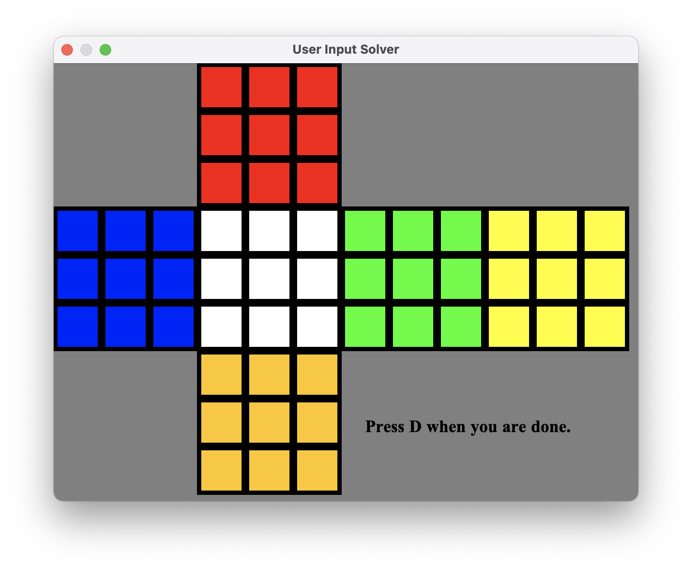

Java Rubik's Cube Solver
=======

This is the repository for a Rubik's cube GUI program created using Java.
I used Swing and AWT for the graphics, and the [TerminalIO package](https://mathbits.com/MathBits/Java/UsingJBuilder/Install.htm) for the keyboard input-output.

## Using the Program

To run the project, compile and run the file `GUIshell.java` 

After you answer the prompt in the console (if you don't want to be given a random sequence of moves to scramble a Rubik's cube, press Enter twice), the first window that will pop up is just a Rubik's cube simulator:

This cube can be manipulated using the **Moves** menu or with keyboard shortcuts.
You can also rotate the whole cube with the commands in the **Rotations** menu.
In the above screenshot, the white face is the "Up" face, and the orange face is the "Front" face.

Selecting the menu option **File > User Input** brings up the following screen:

Clicking on the individual squares (except the middle square on each face, the collection of which serves to fix the rotation state of the whole cube) will cycle through the colors in rainbow order.
When you've finished inputing your cube configuration, press "D".
If you've entered an invalid cube configuration, you should receive an error message in the console.
Otherwise, the console will start to output chunks of moves.
When the algorithm is done, it will output the total number of moves used in the solution.
This may take some time, but the total sequence of moves should solve the cube you've inputted.
If you are holding the cube so that the center square of the top face is white, and the center square of the front face is orange, then a symbol like "U" in the solution sequence means "turn the upper face 90 degrees clockwise"; a symbol like "UI" means "turn the upper face 90 degrees counterclockwise"; and a symbol like "F2" means "turn the front face 180 degrees".

## The Algorithm

It is helpful to model a Rubik's cube in terms of both the individual stickers on the cube and the individual sub-cubes, or cubies.
The `rubiksCube` class keeps track of a cube's state in terms of a permutation of both its cubies and its stickers.
The Permutation class implements the abstract behaviors of a permutation: it is endowed with an `inverse` method and a `concatenate` method.

To solve the cube, the algorithm proceeds in two parts: first it orients the cubies properly, then it permutes the cubies.
In the second parts, we permute three cubies at a time (edges or corners) until all cubies are in the right location.
Then, if necessary, we perform a double-swap of corners and/or edges.
To permute three cubies at a time, we use a fixed sequence of moves producing a three-cycle of cubies, and conjugate it by some sequence of moves of length at most 4.
General theory guarantees that this conjugated sequence is also a 3-cycle of cubies.
The algorithm recursively searches through the conjugating sequences to find moves that bring the cube closer to a solved state.

In the first part of the algorithm, we orient the stickers on the individual cubies so that when we do the second part of the algorithm and the cubies are in the right locations, the stickers on the cubies are also in the right locations.
This is done by generating a lookup table which describes the effect of each possible cube face rotation on all $2^{11}$ edge orientations and all $3^7$ corner orientations, and then conducting a recursive, brute force search through the possible sequences of moves of length at most 7.

